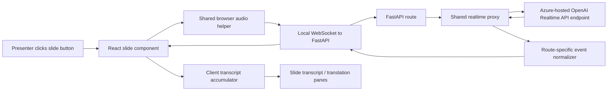

# Realtime Whisper and Translate technical walkthrough

This document explains the realtime demo implementation in the order it runs:
from the slide button, through browser microphone capture, into the local
FastAPI websocket proxy, through the OpenAI Realtime API model endpoint hosted
behind an Azure OpenAI resource, and back into the slide transcript panes.

All source links are pinned to commit `9b2e3f6a197455c770cd748a7796e557ac04009f`, so the line numbers stay stable
even if the code moves later.

## The most important mental model

This is not one generic "Azure realtime" path. The infrastructure is Azure
flavored because the OpenAI Realtime API is reached through an Azure OpenAI
resource host and authenticated with Azure credentials. The behavior that
matters for transcript quality comes from the OpenAI Realtime API endpoint
contract and the model session type.

There are two different contracts:

| Demo | OpenAI Realtime API endpoint contract | Model role | Audio append event | Stop/finalize event | Transcript event shape |
| --- | --- | --- | --- | --- | --- |
| Standalone transcription | `/openai/v1/realtime?intent=transcription` | `gpt-realtime-whisper` deployment transcribes input audio | `input_audio_buffer.append` | `input_audio_buffer.commit` plus local drain | Item-scoped `conversation.item.input_audio_transcription.*` |
| Translation | `/openai/v1/realtime/translations?model=gpt-realtime-translate` | `gpt-realtime-translate` translates; input transcription is configured as `gpt-realtime-whisper` | `session.input_audio_buffer.append` | `session.close`, then wait for `session.closed` | Session-scoped `session.input_transcript.*` and `session.output_transcript.*` |

That distinction explains the debugging result: the translation route can show a
better raw input transcript even though it uses `gpt-realtime-whisper` for input
transcription, because the translations endpoint owns more of the continuous
session segmentation. The standalone Whisper route must manage commit boundaries
unless the hosted endpoint accepts a turn-detection mode.

## Architecture map

Responsibility boundaries:

- The slide component owns UI state: button labels, errors, selected language,
  transcript text, scroll position, and auto-stop when the slide becomes
  inactive.
- `src/lib/realtime-audio.ts` owns microphone access, AudioContext setup,
  resampling, PCM16 conversion, and binary websocket frames.
- `server/src/router/realtime.py` owns route selection, OpenAI Realtime URL
  construction, session update payloads, and route-specific event normalization.
- `server/src/utils/realtime.py` owns the websocket proxy engine, shared state,
  audio append, commit/close, stop drains, finalization tracking, and normalized
  event delivery back to the client.
- `src/lib/realtime-transcript.ts` owns client-side reconciliation of streaming
  deltas and final transcript corrections.

## Source index

- `src/lib/realtime-audio.ts`
  https://github.com/aryxenv/gpt-realtime-whisper-translate/blob/9b2e3f6a197455c770cd748a7796e557ac04009f/src/lib/realtime-audio.ts#L1-L166
- `src/lib/realtime-transcript.ts`
  https://github.com/aryxenv/gpt-realtime-whisper-translate/blob/9b2e3f6a197455c770cd748a7796e557ac04009f/src/lib/realtime-transcript.ts#L1-L121
- `src/components/slides/realtime-transcription-demo/main.tsx`
  https://github.com/aryxenv/gpt-realtime-whisper-translate/blob/9b2e3f6a197455c770cd748a7796e557ac04009f/src/components/slides/realtime-transcription-demo/main.tsx#L1-L257
- `src/components/slides/realtime-translation-demo/main.tsx`
  https://github.com/aryxenv/gpt-realtime-whisper-translate/blob/9b2e3f6a197455c770cd748a7796e557ac04009f/src/components/slides/realtime-translation-demo/main.tsx#L1-L379
- `server/src/router/realtime.py`
  https://github.com/aryxenv/gpt-realtime-whisper-translate/blob/9b2e3f6a197455c770cd748a7796e557ac04009f/server/src/router/realtime.py#L1-L551
- `server/src/utils/realtime.py`
  https://github.com/aryxenv/gpt-realtime-whisper-translate/blob/9b2e3f6a197455c770cd748a7796e557ac04009f/server/src/utils/realtime.py#L1-L617

## Sequence A: standalone `gpt-realtime-whisper` transcription

### A1. The transcription slide decides which websocket URL to use

Function: `getRealtimeWebSocketUrl`

Source:
https://github.com/aryxenv/gpt-realtime-whisper-translate/blob/9b2e3f6a197455c770cd748a7796e557ac04009f/src/components/slides/realtime-transcription-demo/main.tsx#L28-L37

What it does:

- Reads `VITE_REALTIME_WS_URL` if the presenter configured one.
- Falls back to `ws://localhost:8000/realtime/whisper`.
- Adds `languageHint=<code>` only when the presenter selects an explicit
  language hint; auto-detect omits the query param.
- Keeps the browser connected to the local FastAPI proxy, not directly to the
  hosted OpenAI Realtime API endpoint.

Why it matters:

- Browser code never owns Azure credentials.
- The local server can normalize protocol differences before the UI sees them.
- The deck can stay local-first for demos.
- The language hint belongs to the transcription session contract, so it is
  handled on this route rather than the translation route.

### A2. `RealtimeTranscriptionDemo` initializes UI and transcript state

Component setup:
https://github.com/aryxenv/gpt-realtime-whisper-translate/blob/9b2e3f6a197455c770cd748a7796e557ac04009f/src/components/slides/realtime-transcription-demo/main.tsx#L39-L54

What it owns:

- `status`: `idle`, `connecting`, `listening`, `stopping`, or `error`.
- `error`: a presenter-friendly message if the websocket or server fails.
- `transcriptState`: the structured accumulator state, not just a plain string.
- `captureRef`: the live microphone/websocket handles returned by the shared
  audio helper.
- `websocketUrl`: memoized local websocket URL.
- `transcript`: derived display text from `getTranscriptText`.

Important detail:

- The UI renders one clean transcript pane, but internally the transcript state
  can track item IDs and sequence numbers. That is necessary because standalone
  Whisper emits item-scoped events where final text can replace draft deltas.

### A3. The button toggles listening

Function: `toggleListening`

Source:
https://github.com/aryxenv/gpt-realtime-whisper-translate/blob/9b2e3f6a197455c770cd748a7796e557ac04009f/src/components/slides/realtime-transcription-demo/main.tsx#L135-L146

What it does:

- If already listening, calls `stopListening`.
- If connecting or stopping, ignores the click to avoid overlapping sessions.
- Otherwise starts a new microphone session with `startListening`.

Bug it avoids:

- Without the `isBusy` guard, the presenter could create multiple audio graphs
  or multiple websocket sessions from repeated button clicks.

### A4. Starting listening resets state and delegates to shared audio capture

Function: `startListening`

Source:
https://github.com/aryxenv/gpt-realtime-whisper-translate/blob/9b2e3f6a197455c770cd748a7796e557ac04009f/src/components/slides/realtime-transcription-demo/main.tsx#L100-L133

Sequence:

1. Clear old errors.
2. Reset transcript state with `createTranscriptStreamState`.
3. Set UI status to `connecting`.
4. Call `startRealtimeAudioCapture` with:

`websocketUrl`;`handleServerMessage`;websocket error callback;websocket close callback. 5. Store the returned handles in `captureRef`. 6. Move to `listening` if setup succeeds. 7. On failure, clean up partial resources and show a message.

Why the reset happens before opening the mic:

- A new speaking attempt should not append to the previous attempt.
- The accumulator must start with no stale item IDs or session text.

### A5. Shared audio helper opens mic and local websocket

Function: `startRealtimeAudioCapture`

Source:
https://github.com/aryxenv/gpt-realtime-whisper-translate/blob/9b2e3f6a197455c770cd748a7796e557ac04009f/src/lib/realtime-audio.ts#L69-L140

Sequence:

1. Ask the browser for microphone access with `getUserMedia`.
2. Open a WebSocket to the local FastAPI route.
3. Set `binaryType = "arraybuffer"` so audio frames are binary.
4. Wait for the websocket `open` event before building the audio graph.
5. Create an `AudioContext` with target sample rate `24000`.
6. Create a media stream source from the microphone stream.
7. Create a `ScriptProcessorNode` with buffer size `4096`.
8. Create a muted gain node so the audio graph runs without playing mic audio
   through speakers.
9. Attach server message/error/close callbacks.
10. On each audio process callback:

read channel 0;resample to 24 kHz;convert to PCM16;send the binary frame over the websocket.

Why the websocket opens before the audio graph:

- It avoids capturing and dropping early audio while the websocket is still
  connecting.
- It simplifies failure behavior: if the server is down, the mic/audio graph is
  cleaned up immediately.

### A6. The helper waits for websocket readiness

Function: `waitForSocketOpen`

Source:
https://github.com/aryxenv/gpt-realtime-whisper-translate/blob/9b2e3f6a197455c770cd748a7796e557ac04009f/src/lib/realtime-audio.ts#L58-L67

What it does:

- Resolves once the local websocket opens.
- Rejects if the websocket errors before opening.

Why it matters:

- The slide can show a clean "Could not connect" failure before it starts
  streaming microphone frames.

### A7. Audio is resampled to 24 kHz

Function: `resampleLinear`

Source:
https://github.com/aryxenv/gpt-realtime-whisper-translate/blob/9b2e3f6a197455c770cd748a7796e557ac04009f/src/lib/realtime-audio.ts#L33-L56

What it does:

- If the browser audio context already provides 24 kHz, it returns the original
  samples.
- Otherwise it computes an output buffer at the target rate with linear
  interpolation.

Why it matters:

- The server session update declares PCM input at `PCM_SAMPLE_RATE`, which is
  `24000`.
- Sending audio at a different real sample rate than the session declares can
  degrade transcription quality or timing.

### A8. Audio is encoded as PCM16 little-endian

Function: `floatToPcm16`

Source:
https://github.com/aryxenv/gpt-realtime-whisper-translate/blob/9b2e3f6a197455c770cd748a7796e557ac04009f/src/lib/realtime-audio.ts#L20-L31

What it does:

- Clamps each float sample to `[-1, 1]`.
- Converts negative values using `0x8000` and positive values using `0x7fff`.
- Writes each sample with `setInt16(..., true)`, which means little-endian.

Why it matters:

- The server forwards these bytes as base64 audio to the OpenAI Realtime API
  endpoint.
- The model expects the bytes to match the declared audio format.

### A9. FastAPI accepts `/realtime/whisper`

Function: `whisper`

Source:
https://github.com/aryxenv/gpt-realtime-whisper-translate/blob/9b2e3f6a197455c770cd748a7796e557ac04009f/server/src/router/realtime.py#L490-L513

Sequence:

1. Accept the browser websocket.
2. Build the OpenAI Realtime transcription URL.
3. Build the `session.update` payload for standalone transcription.
4. Build the upstream protocol for the standalone Whisper contract.
5. If configuration is invalid, close the local websocket with an internal error.
6. Otherwise call `run_realtime_proxy`.

Why this route is intentionally thin:

- It does not contain the bidirectional proxy loop.
- It selects the contract and normalizer, then delegates shared behavior to
  `server/src/utils/realtime.py`.

### A10. The standalone Whisper URL is built for the transcription endpoint

Function: `build_whisper_realtime_url`

Source:
https://github.com/aryxenv/gpt-realtime-whisper-translate/blob/9b2e3f6a197455c770cd748a7796e557ac04009f/server/src/router/realtime.py#L160-L161

What it returns:

`wss://<resource>.openai.azure.com/openai/v1/realtime?intent=transcription`

Why it matters:

- This selects the OpenAI Realtime transcription endpoint contract.
- The query string is not the same as the translations endpoint.
- This endpoint uses `input_audio_buffer.append` and
  `input_audio_buffer.commit`, not the translation session event names.

### A11. The standalone Whisper session update declares transcription input

Function: `build_whisper_session_update`

Source:
https://github.com/aryxenv/gpt-realtime-whisper-translate/blob/9b2e3f6a197455c770cd748a7796e557ac04009f/server/src/router/realtime.py#L175-L201

What it builds:

- `type: "session.update"`.
- `session.type: "transcription"`.
- `session.audio.input.format.type: "audio/pcm"`.
- `session.audio.input.format.rate: PCM_SAMPLE_RATE`.
- `session.audio.input.transcription.model`: `AZURE_OPENAI_REALTIME_DEPLOYMENT`.
- Optional language hint.
- Optional transcription delay.
- Optional turn detection if configured.

Why it matters:

- This is where the server tells the OpenAI Realtime API endpoint how to
  interpret the incoming bytes.
- The deployment name and declared audio format must align with the actual audio
  frames.
- Optional knobs are guarded because Azure-hosted endpoints may not accept every
  field supported in non-Azure examples or docs.

### A12. Turn detection and delay config are validated before use

Functions:

- `get_language_hint`
  https://github.com/aryxenv/gpt-realtime-whisper-translate/blob/9b2e3f6a197455c770cd748a7796e557ac04009f/server/src/router/realtime.py#L59-L71
- `get_whisper_turn_detection_mode`
  https://github.com/aryxenv/gpt-realtime-whisper-translate/blob/9b2e3f6a197455c770cd748a7796e557ac04009f/server/src/router/realtime.py#L97-L109
- `build_whisper_turn_detection`
  https://github.com/aryxenv/gpt-realtime-whisper-translate/blob/9b2e3f6a197455c770cd748a7796e557ac04009f/server/src/router/realtime.py#L112-L123
- `get_transcription_delay`
  https://github.com/aryxenv/gpt-realtime-whisper-translate/blob/9b2e3f6a197455c770cd748a7796e557ac04009f/server/src/router/realtime.py#L126-L140

What they do:

- Reject invalid env var values early.
- Keep `turn_detection` absent by default.
- Allow guarded experiments with `server_vad` or `semantic_vad`.
- Allow guarded transcription delay values only from the supported set.

Why this matters for Azure-hosted OpenAI Realtime API:

- The conceptual API is OpenAI Realtime, but the accepted request fields can be
  Azure deployment dependent.
- A field that works in one environment can be rejected in another.
- The code fails fast instead of sending ambiguous payloads into the model
  session.

### A13. The standalone Whisper upstream protocol decides append/commit behavior

Function: `build_whisper_upstream_protocol`

Source:
https://github.com/aryxenv/gpt-realtime-whisper-translate/blob/9b2e3f6a197455c770cd748a7796e557ac04009f/server/src/router/realtime.py#L142-L157

What it does:

- If endpoint-owned turn detection is configured, it creates a protocol with:
    - append event `input_audio_buffer.append`;
    - no manual commit event.
- Otherwise it creates a manual-commit protocol with:
    - append event `input_audio_buffer.append`;
    - commit event `input_audio_buffer.commit`;
    - configured commit strategy, defaulting to `silence`;
    - `force_commit_on_stop=True`;
    - `wait_for_pending_finalizations_on_stop=True`.

Why this function is central to quality:

- Standalone Whisper is item/commit oriented by default.
- If you commit only once at stop, one large multilingual buffer can make
  segmentation harder and can lead to language drift or mixed-script quirks.
- The default `silence` strategy gives the model smaller, pause-aligned chunks
  while still preserving enough trailing context.

### A14. Shared proxy opens the upstream OpenAI Realtime websocket

Function: `run_realtime_proxy`

Source:
https://github.com/aryxenv/gpt-realtime-whisper-translate/blob/9b2e3f6a197455c770cd748a7796e557ac04009f/server/src/router/realtime.py#L433-L487

Sequence:

1. Create `DefaultAzureCredential`.
2. Get auth headers.
3. Merge route-specific headers if present.
4. Open the upstream websocket to the OpenAI Realtime API endpoint.
5. Send the route's `session.update`.
6. Send local client status `{ type: "status", status: "connected" }`.
7. Delegate bidirectional streaming to `proxy_realtime_events`.
8. Close the local websocket normally when the realtime session ends.
9. Convert Azure credential or websocket failures into clear websocket close
   reasons.
10. Close the Azure credential in `finally`.

Why it belongs in the route file:

- It knows about Azure credential acquisition and route-specific session update
  payloads.
- It still delegates the generic proxy loop to utilities.

### A15. Azure resource host and bearer auth are built server-side

Functions:

- `get_azure_openai_host`
  https://github.com/aryxenv/gpt-realtime-whisper-translate/blob/9b2e3f6a197455c770cd748a7796e557ac04009f/server/src/utils/realtime.py#L110-L119
- `get_auth_headers`
  https://github.com/aryxenv/gpt-realtime-whisper-translate/blob/9b2e3f6a197455c770cd748a7796e557ac04009f/server/src/utils/realtime.py#L167-L170

What they do:

- Construct `<resource>.openai.azure.com` from `AZURE_OPENAI_RESOURCE_NAME`.
- Request a bearer token for
  `https://cognitiveservices.azure.com/.default` unless overridden.
- Return the `Authorization: Bearer ...` header used for the upstream websocket.

Why the browser does not do this:

- The slide should not expose tokens or Azure credential logic.
- The local FastAPI server is the secure boundary for credentialed access.

### A16. Shared proxy state models audio, sequencing, and finalization

Classes:

- `RealtimeProxyState`
  https://github.com/aryxenv/gpt-realtime-whisper-translate/blob/9b2e3f6a197455c770cd748a7796e557ac04009f/server/src/utils/realtime.py#L38-L56
- `RealtimeUpstreamProtocol`
  https://github.com/aryxenv/gpt-realtime-whisper-translate/blob/9b2e3f6a197455c770cd748a7796e557ac04009f/server/src/utils/realtime.py#L58-L69

What `RealtimeProxyState` tracks:

- Commit timing and audio thresholds.
- Uncommitted audio byte count.
- Whether the uncommitted buffer contains speech.
- Current low-energy/silence duration.
- Item sequence assignment.
- Pending committed item sequences.
- Pending item IDs that still need finals.
- `finalization_event` and `session_closed_event`.
- `send_lock` to serialize upstream sends.

What `RealtimeUpstreamProtocol` describes:

- Which audio append event name to send.
- Whether a commit event exists.
- Whether a session close event exists.
- Which commit strategy to use.
- Whether low-energy audio can be filtered.
- Whether stop should close before draining.
- Whether stop should wait for item finalization or `session.closed`.

Why this abstraction exists:

- Whisper and Translate have different event names and stop semantics.
- The proxy loop can stay shared if those differences are explicit data.

### A17. Proxy state is built from environment-driven timing settings

Function: `build_proxy_state`

Source:
https://github.com/aryxenv/gpt-realtime-whisper-translate/blob/9b2e3f6a197455c770cd748a7796e557ac04009f/server/src/utils/realtime.py#L121-L160

What it does:

- Reads commit interval, silence commit window, max commit audio duration, min
  commit audio duration, min RMS, and stop drain duration.
- Converts millisecond settings into seconds or byte thresholds.
- Initializes a fresh state object per websocket session.

Why it matters:

- The quality-sensitive numbers are centralized.
- Each browser session has isolated counters, pending IDs, and locks.

### A18. The proxy starts client-to-model and model-to-client tasks

Function: `proxy_realtime_events`

Source:
https://github.com/aryxenv/gpt-realtime-whisper-translate/blob/9b2e3f6a197455c770cd748a7796e557ac04009f/server/src/utils/realtime.py#L579-L617

Sequence:

1. Build a fresh `RealtimeProxyState`.
2. Create a `stop_event`.
3. Start `forward_client_events`.
4. Start `forward_azure_events`.
5. If commit strategy is `fixed`, start `auto_commit_audio`.
6. Wait until one task completes.
7. Cancel pending tasks.
8. Re-raise errors from completed tasks.

Why it is concurrent:

- Browser audio must keep flowing upstream while model events flow downstream.
- Stop/finalization logic needs both directions active until the drain finishes.

### A19. Browser audio frames are received and forwarded

Function: `forward_client_events`

Source:
https://github.com/aryxenv/gpt-realtime-whisper-translate/blob/9b2e3f6a197455c770cd748a7796e557ac04009f/server/src/utils/realtime.py#L468-L503

What it handles:

- Browser disconnect.
- Text control messages like `{ "type": "stop" }` or `{ "type": "commit" }`.
- Binary PCM audio frames.

For binary frames:

- Calls `append_audio_chunk`.

For text messages:

- Calls `handle_client_control`.

### A20. Audio chunks are appended to the OpenAI Realtime input buffer

Function: `append_audio_chunk`

Source:
https://github.com/aryxenv/gpt-realtime-whisper-translate/blob/9b2e3f6a197455c770cd748a7796e557ac04009f/server/src/utils/realtime.py#L200-L259

Sequence:

1. Compute RMS with `get_pcm16_rms`.
2. Track silent duration.
3. Skip leading low-energy audio before speech for manual-commit protocols.
4. Build the route-specific audio append event:

Whisper: `input_audio_buffer.append`;Translate: `session.input_audio_buffer.append`. 5. Base64-encode the PCM bytes into the `audio` field. 6. Send upstream under `state.send_lock`. 7. Update uncommitted byte count and speech/silence flags. 8. For silence strategy:

commit after enough pause;or commit when max audio window is reached.

Why RMS handling matters:

- Leading silence before speech should not become an empty commit.
- Trailing silence after speech can be useful because it lets the silence
  strategy detect a natural boundary.
- Filtering too aggressively would remove context; never filtering could create
  giant buffers.

### A21. Manual commits create item boundaries for standalone Whisper

Function: `commit_audio_buffer`

Source:
https://github.com/aryxenv/gpt-realtime-whisper-translate/blob/9b2e3f6a197455c770cd748a7796e557ac04009f/server/src/utils/realtime.py#L262-L299

Sequence:

1. Return immediately if the protocol has no commit event.
2. Under `send_lock`, check whether there is enough speech audio to commit.
3. Send `{ "type": "input_audio_buffer.commit" }`.
4. Append the next sequence number to `pending_sequences`.
5. Signal `finalization_event`.
6. Increment `next_sequence`.
7. Reset uncommitted audio counters.

Why pending sequence exists:

- The model later emits an item ID for the committed audio.
- The client needs stable ordering even if delta/final events arrive in a
  surprising order.
- The server assigns sequence numbers at commit time, then binds them to item
  IDs when item-scoped events arrive.

### A22. Upstream model events are normalized before the UI sees them

Function: `forward_azure_events`

Source:
https://github.com/aryxenv/gpt-realtime-whisper-translate/blob/9b2e3f6a197455c770cd748a7796e557ac04009f/server/src/utils/realtime.py#L553-L576

Sequence:

1. Read each upstream websocket message.
2. Ignore binary messages.
3. Parse JSON text.
4. If parsing fails, send a normalized error to the client.
5. Call the route-specific normalizer.
6. Send normalized events to the browser.

Function: `send_normalized_client_events`

Source:
https://github.com/aryxenv/gpt-realtime-whisper-translate/blob/9b2e3f6a197455c770cd748a7796e557ac04009f/server/src/utils/realtime.py#L541-L550

What it does:

- Ignores `None`.
- Allows a normalizer to return one event or a list of events.
- Sends each normalized event as JSON text to the local browser websocket.

### A23. Whisper item sequence metadata is assigned and preserved

Functions:

- `assign_item_sequence`
  https://github.com/aryxenv/gpt-realtime-whisper-translate/blob/9b2e3f6a197455c770cd748a7796e557ac04009f/server/src/router/realtime.py#L244-L259
- `get_or_assign_item_sequence`
  https://github.com/aryxenv/gpt-realtime-whisper-translate/blob/9b2e3f6a197455c770cd748a7796e557ac04009f/server/src/router/realtime.py#L261-L280
- `add_transcription_item_metadata`
  https://github.com/aryxenv/gpt-realtime-whisper-translate/blob/9b2e3f6a197455c770cd748a7796e557ac04009f/server/src/router/realtime.py#L282-L294

What they do:

- Connect upstream `item_id` values to local sequence numbers.
- Prefer the sequence that was reserved at commit time.
- Fall back to assigning the next sequence if an item appears without a pending
  sequence.
- Attach `itemId`, `contentIndex`, and `sequence` to normalized transcript
  events.

Why this matters:

- Standalone Whisper emits item-scoped events.
- The UI should not expose item buckets, but it still needs sequence metadata to
  render corrected segments in order.

### A24. Whisper transcript delta and completion events become one app contract

Functions:

- `get_text_delta`
  https://github.com/aryxenv/gpt-realtime-whisper-translate/blob/9b2e3f6a197455c770cd748a7796e557ac04009f/server/src/router/realtime.py#L296-L302
- `normalize_transcription_delta`
  https://github.com/aryxenv/gpt-realtime-whisper-translate/blob/9b2e3f6a197455c770cd748a7796e557ac04009f/server/src/router/realtime.py#L305-L320
- `normalize_transcription_completed`
  https://github.com/aryxenv/gpt-realtime-whisper-translate/blob/9b2e3f6a197455c770cd748a7796e557ac04009f/server/src/router/realtime.py#L322-L335

What they do:

- Read text from `delta`, `text`, or `transcript`.
- Convert item-scoped upstream deltas into:
    - `{ type: "transcript.delta", delta, itemId, sequence }`.
- Convert item-scoped upstream finals into:
    - `{ type: "transcript.completed", transcript, itemId, sequence }`.
- Mark item IDs as pending on deltas and finalized on completed events.

Why completed events are not optional:

- Deltas are draft streaming text.
- Completed events can revise or clean up earlier text.
- If the client only appends deltas, it can preserve hallucinated or partial
  text that the model later corrected.

### A25. `normalize_whisper_event` maps raw model events to slide-safe events

Function: `normalize_whisper_event`

Source:
https://github.com/aryxenv/gpt-realtime-whisper-translate/blob/9b2e3f6a197455c770cd748a7796e557ac04009f/server/src/router/realtime.py#L338-L381

Important mappings:

- `input_audio_buffer.committed` -> `audio.committed` with item metadata.
- `input_audio_buffer.speech_started` / `speech_stopped` -> status events.
- `conversation.item.input_audio_transcription.delta` -> transcript delta.
- `conversation.item.input_audio_transcription.completed` -> transcript
  completed.
- `session.input_transcript.delta` -> transcript delta for endpoint variants
  that emit session-scoped events.
- `session.input_transcript.completed` / `done` -> transcript completed.
- `conversation.item.input_audio_transcription.failed` -> error event and item
  finalization.
- `error` -> normalized error; if the model skipped a too-small commit, discard
  the reserved pending sequence.
- `session.created` / `session.updated` -> status events.

Why this layer exists:

- The slide should not know every raw OpenAI Realtime event name.
- Route-specific quirks stay server-side.
- The client gets a compact, stable contract.

### A26. Client receives normalized events and updates the transcript accumulator

Function: `handleServerMessage`

Source:
https://github.com/aryxenv/gpt-realtime-whisper-translate/blob/9b2e3f6a197455c770cd748a7796e557ac04009f/src/components/slides/realtime-transcription-demo/main.tsx#L68-L98

Sequence:

1. Ensure the server message is text.
2. Parse JSON.
3. If event type is `transcript.delta` or `transcript.completed`, call
   `applyTranscriptEvent`.
4. If event type is `error`, show a slide error and enter error status.
5. If status is `connected`, enter listening status.

Why the server contract is small:

- The slide only needs `transcript.delta`, `transcript.completed`, `status`, and
  `error`.
- The complex OpenAI Realtime event taxonomy is handled in the route normalizer.

### A27. The transcript accumulator reconciles deltas and finals

Functions:

- `createTranscriptStreamState`
  https://github.com/aryxenv/gpt-realtime-whisper-translate/blob/9b2e3f6a197455c770cd748a7796e557ac04009f/src/lib/realtime-transcript.ts#L21-L26
- `appendTextDelta`
  https://github.com/aryxenv/gpt-realtime-whisper-translate/blob/9b2e3f6a197455c770cd748a7796e557ac04009f/src/lib/realtime-transcript.ts#L28-L34
- `upsertSegment`
  https://github.com/aryxenv/gpt-realtime-whisper-translate/blob/9b2e3f6a197455c770cd748a7796e557ac04009f/src/lib/realtime-transcript.ts#L43-L76
- `applyTranscriptEvent`
  https://github.com/aryxenv/gpt-realtime-whisper-translate/blob/9b2e3f6a197455c770cd748a7796e557ac04009f/src/lib/realtime-transcript.ts#L78-L111
- `getTranscriptText`
  https://github.com/aryxenv/gpt-realtime-whisper-translate/blob/9b2e3f6a197455c770cd748a7796e557ac04009f/src/lib/realtime-transcript.ts#L113-L121

How item-scoped Whisper events are handled:

- Deltas with `itemId` append to that item's segment.
- Completed events with `itemId` replace that item's draft text.
- Segments sort by `sequence` before rendering.
- The UI gets one joined plain transcript string.

How session-scoped events are handled:

- Deltas without `itemId` append to `sessionText`.
- Completed events without `itemId` replace the whole session text.

Why this fixes the "partials only" concern:

- The slide can show live deltas immediately.
- When a final arrives, the final text wins for that item.
- Out-of-order item completions do not scramble the transcript.

### A28. The transcript pane scrolls as text grows

Scroll effect:
https://github.com/aryxenv/gpt-realtime-whisper-translate/blob/9b2e3f6a197455c770cd748a7796e557ac04009f/src/components/slides/realtime-transcription-demo/main.tsx#L158-L165

What it does:

- Finds the transcript pane.
- Sets `scrollTop` to `scrollHeight` whenever derived transcript text changes.

Why it matters for presenting:

- The newest text stays visible during a live demo without manual scrolling.

### A29. Stop sends a graceful control message instead of immediately closing

Functions:

- `stopListening`
  https://github.com/aryxenv/gpt-realtime-whisper-translate/blob/9b2e3f6a197455c770cd748a7796e557ac04009f/src/components/slides/realtime-transcription-demo/main.tsx#L56-L66
- `cleanupRealtimeAudioCapture`
  https://github.com/aryxenv/gpt-realtime-whisper-translate/blob/9b2e3f6a197455c770cd748a7796e557ac04009f/src/lib/realtime-audio.ts#L142-L166

Sequence:

1. `stopListening` sets status to `stopping`.
2. `cleanupRealtimeAudioCapture` disconnects audio nodes.
3. It stops microphone tracks.
4. If the local websocket is open, it sends `{ "type": "stop" }`.
5. Because `gracefulStop` is true, it does not immediately close the socket.
6. It closes the AudioContext.

Why graceful stop matters:

- The server needs time to commit remaining audio and drain final model events.
- Closing the browser websocket immediately can cut off the tail of a transcript.

### A30. Server stop control commits and drains final Whisper events

Function: `handle_client_control`

Source:
https://github.com/aryxenv/gpt-realtime-whisper-translate/blob/9b2e3f6a197455c770cd748a7796e557ac04009f/server/src/utils/realtime.py#L392-L465

For `{ "type": "stop" }` on standalone Whisper:

1. If the protocol supports commit, force a final commit when configured.
2. Because Whisper does not close before drain, skip session close before drain.
3. Because `wait_for_pending_finalizations_on_stop=True`, call
   `wait_for_pending_finalizations`.
4. Close upstream session if a close event exists later; Whisper does not use
   one in the current protocol.
5. Set `stop_event`.

Function: `wait_for_pending_finalizations`

Source:
https://github.com/aryxenv/gpt-realtime-whisper-translate/blob/9b2e3f6a197455c770cd748a7796e557ac04009f/server/src/utils/realtime.py#L335-L368

What it waits for:

- Pending reserved commit sequences.
- Pending item IDs that have emitted deltas but not final completion.
- It exits when all are resolved or when the stop drain timeout is reached.

Why this is the main standalone Whisper tail fix:

- Commit creates an item, but the final transcript can arrive later.
- The server must keep both websocket directions alive long enough to receive
  `conversation.item.input_audio_transcription.completed`.

## Sequence B: `gpt-realtime-translate` with `gpt-realtime-whisper` input transcription

### B1. The translation slide builds a language-specific local websocket URL

Functions:

- `getTranslationWebSocketBaseUrl`
  https://github.com/aryxenv/gpt-realtime-whisper-translate/blob/9b2e3f6a197455c770cd748a7796e557ac04009f/src/components/slides/realtime-translation-demo/main.tsx#L61-L70
- `getTranslationWebSocketUrl`
  https://github.com/aryxenv/gpt-realtime-whisper-translate/blob/9b2e3f6a197455c770cd748a7796e557ac04009f/src/components/slides/realtime-translation-demo/main.tsx#L72-L84

What they do:

- Read `VITE_REALTIME_TRANSLATION_WS_URL` if configured.
- Fall back to `ws://localhost:8000/realtime/translation`.
- Add `targetLanguage=<code>` to the query string.
- Preserve existing query strings if a custom base URL already has one.

Why target language is in the URL:

- It lets the server validate the requested output language before opening the
  upstream model session.
- It keeps the audio binary stream simple after connection starts.

### B2. The translation slide keeps source transcript and translation separate

Component setup:
https://github.com/aryxenv/gpt-realtime-whisper-translate/blob/9b2e3f6a197455c770cd748a7796e557ac04009f/src/components/slides/realtime-translation-demo/main.tsx#L127-L150

What it owns:

- `targetLanguage`: selected output language code.
- `transcriptState`: raw input transcript accumulator.
- `translation`: translated output text string.
- Separate scroll refs for source transcript and translation.

Why there are two panes:

- The OpenAI Realtime translations endpoint can emit both input transcript
  deltas and translated output deltas.
- Showing them separately makes it clear whether an issue is input recognition
  or translation output.

### B3. `StreamPane` renders either source transcript or translation

Function: `StreamPane`

Source:
https://github.com/aryxenv/gpt-realtime-whisper-translate/blob/9b2e3f6a197455c770cd748a7796e557ac04009f/src/components/slides/realtime-translation-demo/main.tsx#L86-L125

What it does:

- Renders a shared card layout.
- Shows a badge label.
- Scrolls within its own pane.
- Shows placeholder text when empty.
- Renders live text with whitespace preserved.

Why it is local to the slide:

- It is presentation-specific UI, not general realtime infrastructure.

### B4. Starting and stopping translation uses the same browser audio helper

Functions:

- `startListening`
  https://github.com/aryxenv/gpt-realtime-whisper-translate/blob/9b2e3f6a197455c770cd748a7796e557ac04009f/src/components/slides/realtime-translation-demo/main.tsx#L208-L242
- `toggleListening`
  https://github.com/aryxenv/gpt-realtime-whisper-translate/blob/9b2e3f6a197455c770cd748a7796e557ac04009f/src/components/slides/realtime-translation-demo/main.tsx#L244-L255
- `stopListening`
  https://github.com/aryxenv/gpt-realtime-whisper-translate/blob/9b2e3f6a197455c770cd748a7796e557ac04009f/src/components/slides/realtime-translation-demo/main.tsx#L152-L162

What is shared with Whisper:

- Same microphone permission flow.
- Same 24 kHz PCM16 audio frames.
- Same graceful stop control message.
- Same inactive-slide cleanup behavior.

What differs:

- The websocket URL includes `targetLanguage`.
- The server route uses the translations endpoint contract.
- The UI handles both transcript and translation events.

### B5. FastAPI accepts `/realtime/translation`

Function: `translation`

Source:
https://github.com/aryxenv/gpt-realtime-whisper-translate/blob/9b2e3f6a197455c770cd748a7796e557ac04009f/server/src/router/realtime.py#L516-L550

Sequence:

1. Accept the browser websocket.
2. Validate the target language from query params.
3. Build the OpenAI Realtime translations URL.
4. Build the translation `session.update`.
5. Call `run_realtime_proxy` with:

- `normalize_translation_event`;
- `additional_headers={"openai-alpha": "translation=v1"}`;
- `TRANSLATION_UPSTREAM_PROTOCOL`.

Why the `openai-alpha` header matters:

- The internal sample uses `openai-alpha: translation=v1`.
- The translations endpoint requires the translation feature contract, not the
  standalone transcription contract.

### B6. Translation target language is validated server-side

Function: `get_translation_target_language`

Source:
https://github.com/aryxenv/gpt-realtime-whisper-translate/blob/9b2e3f6a197455c770cd748a7796e557ac04009f/server/src/router/realtime.py#L204-L218

What it does:

- Reads `targetLanguage`, then `language`, then defaults to `nl`.
- Normalizes to lowercase.
- Rejects unsupported codes with a clear error.

Why this belongs on the server:

- The server builds the upstream session update.
- Invalid values should not be sent to the model endpoint.

Unlike the standalone transcription session, the translation session rejects
`session.audio.input.transcription.language`. Source-language hinting is
therefore not exposed on this route; the endpoint handles input-language
behavior internally while the slide controls only target output language.

### B7. The translations URL selects `gpt-realtime-translate`

Function: `build_translation_realtime_url`

Source:
https://github.com/aryxenv/gpt-realtime-whisper-translate/blob/9b2e3f6a197455c770cd748a7796e557ac04009f/server/src/router/realtime.py#L164-L172

What it returns:

`wss://<resource>.openai.azure.com/openai/v1/realtime/translations?model=<model>`

Default model:

- `gpt-realtime-translate`.

Why it matters:

- This endpoint contract is different from `/openai/v1/realtime?intent=transcription`.
- It accepts `session.input_audio_buffer.append`.
- It is finalized with `session.close`.

### B8. The translation session update configures input transcription and output language

Function: `build_translation_session_update`

Source:
https://github.com/aryxenv/gpt-realtime-whisper-translate/blob/9b2e3f6a197455c770cd748a7796e557ac04009f/server/src/router/realtime.py#L221-L241

What it builds:

- `type: "session.update"`.
- `session.audio.input.transcription.model` defaults to
  `gpt-realtime-whisper`.
- `session.audio.output.language` uses the validated target language.

Critical distinction:

- This does not make the route equivalent to standalone Whisper.
- The input transcription model name is the same, but the session is owned by
  the translations endpoint, which emits different event types and manages
  segmentation differently.

### B9. Translation protocol uses continuous append and session close

Constant: `TRANSLATION_UPSTREAM_PROTOCOL`

Source:
https://github.com/aryxenv/gpt-realtime-whisper-translate/blob/9b2e3f6a197455c770cd748a7796e557ac04009f/server/src/router/realtime.py#L51-L56

Configured behavior:

- `audio_append_event_type="session.input_audio_buffer.append"`.
- `session_close_event_type="session.close"`.
- `close_session_before_drain=True`.
- `wait_for_session_closed_on_stop=True`.

Why this was necessary:

- Sending standalone Whisper's `input_audio_buffer.append` or
  `input_audio_buffer.commit` to the translations endpoint causes protocol
  errors.
- The translations endpoint expects audio under the `session.*` event namespace.
- The session must be closed before draining final translated output.

### B10. Translation stop sends `session.close` and waits for `session.closed`

Functions:

- `handle_client_control`
  https://github.com/aryxenv/gpt-realtime-whisper-translate/blob/9b2e3f6a197455c770cd748a7796e557ac04009f/server/src/utils/realtime.py#L392-L465
- `close_upstream_session`
  https://github.com/aryxenv/gpt-realtime-whisper-translate/blob/9b2e3f6a197455c770cd748a7796e557ac04009f/server/src/utils/realtime.py#L380-L390
- `wait_for_session_closed`
  https://github.com/aryxenv/gpt-realtime-whisper-translate/blob/9b2e3f6a197455c770cd748a7796e557ac04009f/server/src/utils/realtime.py#L370-L378

For `{ "type": "stop" }` on translation:

1. No audio commit is sent because translation protocol has no commit event.
2. `close_session_before_drain=True`, so send `{ "type": "session.close" }`
   immediately.
3. `wait_for_session_closed_on_stop=True`, so wait for the upstream
   `session.closed` event.
4. Set `stop_event`.

Why this fixes translation tail cut-off:

- The translation model may still be producing final transcript or translated
  text after the microphone stops.
- If the browser or proxy closes early, the final translated tail can be lost.
- Waiting for `session.closed` lets the endpoint finish the session.

### B11. Translation events normalize to source transcript and translated output

Function: `normalize_translation_event`

Source:
https://github.com/aryxenv/gpt-realtime-whisper-translate/blob/9b2e3f6a197455c770cd748a7796e557ac04009f/server/src/router/realtime.py#L384-L430

Important mappings:

- `session.input_transcript.delta` -> `transcript.delta`.
- `session.output_transcript.delta` -> `translation.delta`.
- `session.input_transcript.completed` / `done` -> `transcript.completed`.
- `session.output_transcript.completed` / `done` ->
  `translation.completed`.
- `session.output_audio.delta` -> ignored because the slide is text-only.
- `session.closed` -> mark session closed and send status.
- `error` -> normalized error.
- `session.created` / `session.updated` -> status events.

Why it is simpler than Whisper normalization:

- Translation transcript events are session-scoped.
- There are no item IDs or commit sequence numbers to reconcile for the source
  transcript stream.

### B12. Translation slide handles both stream types

Function: `handleServerMessage`

Source:
https://github.com/aryxenv/gpt-realtime-whisper-translate/blob/9b2e3f6a197455c770cd748a7796e557ac04009f/src/components/slides/realtime-translation-demo/main.tsx#L164-L206

Sequence:

1. Parse the server JSON text message.
2. `transcript.delta` -> `applyTranscriptEvent`.
3. `translation.delta` -> append to the translation string.
4. `transcript.completed` -> `applyTranscriptEvent`.
5. `translation.completed` -> replace the translation string with the final.
6. `error` -> show error and enter error status.
7. `connected` status -> enter listening state.

Why translation can use a simple translation string:

- The output translation stream is session-scoped in this app contract.
- The server normalizer does not need item sequence metadata for translation
  output.

### B13. Both panes auto-scroll independently

Effects:

- Source transcript scroll:
  https://github.com/aryxenv/gpt-realtime-whisper-translate/blob/9b2e3f6a197455c770cd748a7796e557ac04009f/src/components/slides/realtime-translation-demo/main.tsx#L267-L274
- Translation scroll:
  https://github.com/aryxenv/gpt-realtime-whisper-translate/blob/9b2e3f6a197455c770cd748a7796e557ac04009f/src/components/slides/realtime-translation-demo/main.tsx#L276-L283

What they do:

- Keep the latest source transcript visible.
- Keep the latest translated output visible.

Why they are separate:

- Source and translation can grow at different rates.
- The presenter may need to compare them side by side.

## Shared server utility details

### Environment parsing fails fast

Functions:

- `get_required_env`
  https://github.com/aryxenv/gpt-realtime-whisper-translate/blob/9b2e3f6a197455c770cd748a7796e557ac04009f/server/src/utils/realtime.py#L71-L75
- `get_int_env`
  https://github.com/aryxenv/gpt-realtime-whisper-translate/blob/9b2e3f6a197455c770cd748a7796e557ac04009f/server/src/utils/realtime.py#L78-L92
- `get_float_env`
  https://github.com/aryxenv/gpt-realtime-whisper-translate/blob/9b2e3f6a197455c770cd748a7796e557ac04009f/server/src/utils/realtime.py#L94-L107
- `get_optional_model_env`
  https://github.com/aryxenv/gpt-realtime-whisper-translate/blob/9b2e3f6a197455c770cd748a7796e557ac04009f/server/src/router/realtime.py#L74-L80

Why they matter:

- Realtime protocol errors can be noisy and hard to diagnose once a websocket is
  open.
- Validating early gives deterministic failures for missing resource names,
  invalid timing values, or empty model names.

### PCM timing helpers connect bytes to realtime windows

Functions:

- `get_audio_duration_seconds`
  https://github.com/aryxenv/gpt-realtime-whisper-translate/blob/9b2e3f6a197455c770cd748a7796e557ac04009f/server/src/utils/realtime.py#L163-L165
- `get_pcm16_rms`
  https://github.com/aryxenv/gpt-realtime-whisper-translate/blob/9b2e3f6a197455c770cd748a7796e557ac04009f/server/src/utils/realtime.py#L187-L198

What they do:

- Convert PCM byte length to seconds using 24 kHz and 2 bytes per sample.
- Compute normalized RMS for low-energy detection.

Why they matter:

- Commit strategy decisions are based on audio duration and speech/silence
  state, not arbitrary frame counts.

### Error normalization avoids leaking raw protocol complexity to the slide

Function: `normalize_error_event`

Source:
https://github.com/aryxenv/gpt-realtime-whisper-translate/blob/9b2e3f6a197455c770cd748a7796e557ac04009f/server/src/utils/realtime.py#L517-L538

What it does:

- Extracts the best available error message.
- Treats "buffer too small" as a non-fatal `commit_skipped` status.
- Logs other upstream errors and sends a normalized client error.

Why this matters:

- Small skipped commits can happen with aggressive commit timing and should not
  look like fatal demo failure.
- Real protocol errors still surface clearly.

## Why the same Whisper model name produced different behavior

The translation session configures:

`session.audio.input.transcription.model = "gpt-realtime-whisper"`

That is visible here:
https://github.com/aryxenv/gpt-realtime-whisper-translate/blob/9b2e3f6a197455c770cd748a7796e557ac04009f/server/src/router/realtime.py#L221-L241

The standalone transcription session also uses a Whisper model deployment:
https://github.com/aryxenv/gpt-realtime-whisper-translate/blob/9b2e3f6a197455c770cd748a7796e557ac04009f/server/src/router/realtime.py#L175-L201

But those are not the same runtime contract.

Translation:

- is opened through `/openai/v1/realtime/translations`;
- uses `gpt-realtime-translate` as the session model;
- uses `gpt-realtime-whisper` as an input transcription model inside that
  translation session;
- receives continuous audio with `session.input_audio_buffer.append`;
- finalizes with `session.close`;
- emits session-scoped input transcript and output translation deltas.

Standalone Whisper:

- is opened through `/openai/v1/realtime?intent=transcription`;
- uses a transcription session;
- receives audio with `input_audio_buffer.append`;
- usually needs explicit `input_audio_buffer.commit` boundaries unless the
  endpoint accepts turn detection;
- emits item-scoped transcription deltas and completed events.

The practical result:

- Translation can be more fluent because the translations endpoint owns the
  continuous session segmentation.
- Standalone Whisper quality depends heavily on how the local proxy commits
  audio buffers and whether final completed events replace draft deltas.

Practical takeaway:

- During testing, the `gpt-realtime-translate` route produced noticeably more
  fluent input transcripts than the standalone `gpt-realtime-whisper` route.
- The likely reason is endpoint-owned segmentation: the translations endpoint
  keeps more continuous context and decides its own internal boundaries.
- That segmentation behavior is not exposed as reusable client logic. If the
  goal is the cleanest realtime input transcript, one practical option is to use
  `gpt-realtime-translate`, read `session.input_transcript.*`, and ignore the
  translated output. The tradeoff is that this uses the translation endpoint
  contract even when the app only needs transcription.

## Root-cause notes from debugging

### Issue 1: protocol event names were not interchangeable

Symptom:

- The translations endpoint rejected `input_audio_buffer.append`.

Root cause:

- Translation expects `session.input_audio_buffer.append`.
- Standalone Whisper expects `input_audio_buffer.append`.

Where the fix is encoded:

- Translation protocol constant:
  https://github.com/aryxenv/gpt-realtime-whisper-translate/blob/9b2e3f6a197455c770cd748a7796e557ac04009f/server/src/router/realtime.py#L51-L56
- Whisper protocol builder:
  https://github.com/aryxenv/gpt-realtime-whisper-translate/blob/9b2e3f6a197455c770cd748a7796e557ac04009f/server/src/router/realtime.py#L142-L157

### Issue 2: translation needed session close before draining

Symptom:

- Translation or final text could stop short.

Root cause:

- The translations endpoint needs `session.close` to finish the session and
  flush final transcript/translation events.
- The local websocket must stay open until `session.closed` or timeout.

Where the fix is encoded:

- Protocol flags:
  https://github.com/aryxenv/gpt-realtime-whisper-translate/blob/9b2e3f6a197455c770cd748a7796e557ac04009f/server/src/router/realtime.py#L51-L56
- Stop handling:
  https://github.com/aryxenv/gpt-realtime-whisper-translate/blob/9b2e3f6a197455c770cd748a7796e557ac04009f/server/src/utils/realtime.py#L392-L433
- `session.closed` marker:
  https://github.com/aryxenv/gpt-realtime-whisper-translate/blob/9b2e3f6a197455c770cd748a7796e557ac04009f/server/src/router/realtime.py#L420-L422

### Issue 3: standalone Whisper got weird on giant multilingual buffers

Symptom:

- Standalone Whisper produced mixed-language or mixed-script quirks when
  translation input transcript looked cleaner.

Root cause:

- Committing only at stop can send one very large multilingual buffer.
- That makes segmentation and language switching harder for standalone
  transcription.
- The translations endpoint had better session-owned segmentation.

Where the fix is encoded:

- Default commit strategy:
  https://github.com/aryxenv/gpt-realtime-whisper-translate/blob/9b2e3f6a197455c770cd748a7796e557ac04009f/server/src/router/realtime.py#L37-L41
- Silence and max-window commit behavior:
  https://github.com/aryxenv/gpt-realtime-whisper-translate/blob/9b2e3f6a197455c770cd748a7796e557ac04009f/server/src/utils/realtime.py#L245-L258

### Issue 4: deltas alone were not enough

Symptom:

- UI could show partials or miss final corrections.

Root cause:

- Standalone Whisper emits item-scoped draft deltas and completed finals.
- Completed finals can replace draft text.
- Appending only deltas loses model corrections.

Where the fix is encoded:

- Server attaches item sequence metadata:
  https://github.com/aryxenv/gpt-realtime-whisper-translate/blob/9b2e3f6a197455c770cd748a7796e557ac04009f/server/src/router/realtime.py#L244-L294
- Client replaces item draft text on completed events:
  https://github.com/aryxenv/gpt-realtime-whisper-translate/blob/9b2e3f6a197455c770cd748a7796e557ac04009f/src/lib/realtime-transcript.ts#L78-L111

## Configuration reference

| Variable | Used by | Purpose |
| --- | --- | --- |
| `AZURE_OPENAI_RESOURCE_NAME` | `get_azure_openai_host` | Builds `<resource>.openai.azure.com` for the hosted OpenAI Realtime API websocket. |
| `AZURE_OPENAI_TOKEN_SCOPE` | `get_auth_headers` | Optional token scope override; defaults to Cognitive Services. |
| `AZURE_OPENAI_REALTIME_DEPLOYMENT` | `build_whisper_session_update` | Standalone Whisper transcription model/deployment. |
| `AZURE_OPENAI_REALTIME_LANGUAGE_HINT` | `get_language_hint` | Optional single-language hint for standalone transcription. |
| `AZURE_OPENAI_REALTIME_TRANSCRIPTION_DELAY` | `get_transcription_delay` | Optional guarded transcription delay value. |
| `AZURE_OPENAI_REALTIME_TURN_DETECTION` | `build_whisper_turn_detection` | Optional endpoint-owned turn detection mode. |
| `AZURE_OPENAI_REALTIME_COMMIT_STRATEGY` | `build_whisper_upstream_protocol` | Manual commit strategy when turn detection is not used. |
| `AZURE_OPENAI_REALTIME_MIN_COMMIT_AUDIO_MS` | `build_proxy_state` | Minimum audio window before normal commit. |
| `AZURE_OPENAI_REALTIME_MAX_COMMIT_AUDIO_MS` | `build_proxy_state` | Max audio window fallback for long speech. |
| `AZURE_OPENAI_REALTIME_SILENCE_COMMIT_MS` | `build_proxy_state` | Pause duration used by silence commit strategy. |
| `AZURE_OPENAI_REALTIME_STOP_DRAIN_MS` | `build_proxy_state` | Max wait for finals or `session.closed` on stop. |
| `AZURE_OPENAI_REALTIME_TRANSLATION_MODEL` | `build_translation_realtime_url` | Translation session model, default `gpt-realtime-translate`. |
| `AZURE_OPENAI_REALTIME_TRANSLATION_INPUT_TRANSCRIPTION_MODEL` | `build_translation_session_update` | Input transcription model inside translation session, default `gpt-realtime-whisper`. |
| `VITE_REALTIME_WS_URL` | transcription slide | Local browser websocket override for Whisper demo. |
| `VITE_REALTIME_TRANSLATION_WS_URL` | translation slide | Local browser websocket override for translation demo. |

Per-session translation query params:

- `targetLanguage=<code>` selects output language and defaults to `nl`.

Per-session Whisper query params:

- `languageHint=<code>` optionally hints the transcription language. Omit it, or
  use `auto`, for automatic detection.

## Troubleshooting guide

| Symptom | Where to look | Reasoning |
| --- | --- | --- |
| Browser asks for mic but then fails | `startRealtimeAudioCapture` https://github.com/aryxenv/gpt-realtime-whisper-translate/blob/9b2e3f6a197455c770cd748a7796e557ac04009f/src/lib/realtime-audio.ts#L69-L140 | Failure can happen in `getUserMedia`, websocket open, or AudioContext setup. |
| Slide never reaches listening | `run_realtime_proxy` https://github.com/aryxenv/gpt-realtime-whisper-translate/blob/9b2e3f6a197455c770cd748a7796e557ac04009f/server/src/router/realtime.py#L433-L487 | The server only sends `connected` after auth, upstream websocket open, and `session.update` send. |
| Translation says unsupported target language | `get_translation_target_language` https://github.com/aryxenv/gpt-realtime-whisper-translate/blob/9b2e3f6a197455c770cd748a7796e557ac04009f/server/src/router/realtime.py#L204-L218 | The server rejects target languages outside the supported set. |
| Protocol error says unsupported append/commit event | `TRANSLATION_UPSTREAM_PROTOCOL` and `build_whisper_upstream_protocol` https://github.com/aryxenv/gpt-realtime-whisper-translate/blob/9b2e3f6a197455c770cd748a7796e557ac04009f/server/src/router/realtime.py#L51-L56 https://github.com/aryxenv/gpt-realtime-whisper-translate/blob/9b2e3f6a197455c770cd748a7796e557ac04009f/server/src/router/realtime.py#L142-L157 | Whisper and Translate use different OpenAI Realtime event namespaces. |
| Translation loses the final tail | `handle_client_control`, `wait_for_session_closed`, `normalize_translation_event` https://github.com/aryxenv/gpt-realtime-whisper-translate/blob/9b2e3f6a197455c770cd748a7796e557ac04009f/server/src/utils/realtime.py#L392-L433 https://github.com/aryxenv/gpt-realtime-whisper-translate/blob/9b2e3f6a197455c770cd748a7796e557ac04009f/server/src/utils/realtime.py#L370-L378 https://github.com/aryxenv/gpt-realtime-whisper-translate/blob/9b2e3f6a197455c770cd748a7796e557ac04009f/server/src/router/realtime.py#L384-L430 | Translation stop must send `session.close` and drain until `session.closed`. |
| Whisper has language drift or mixed scripts | `append_audio_chunk`, `commit_audio_buffer`, `build_whisper_upstream_protocol` https://github.com/aryxenv/gpt-realtime-whisper-translate/blob/9b2e3f6a197455c770cd748a7796e557ac04009f/server/src/utils/realtime.py#L200-L299 https://github.com/aryxenv/gpt-realtime-whisper-translate/blob/9b2e3f6a197455c770cd748a7796e557ac04009f/server/src/router/realtime.py#L142-L157 | Commit windows may be too large, or endpoint-owned segmentation is not active. |
| Transcript shows partial text instead of corrected final text | `normalize_transcription_completed`, `applyTranscriptEvent` https://github.com/aryxenv/gpt-realtime-whisper-translate/blob/9b2e3f6a197455c770cd748a7796e557ac04009f/server/src/router/realtime.py#L322-L335 https://github.com/aryxenv/gpt-realtime-whisper-translate/blob/9b2e3f6a197455c770cd748a7796e557ac04009f/src/lib/realtime-transcript.ts#L78-L111 | Completed item events must replace the draft segment, not append blindly. |
| Transcript order is wrong | `get_or_assign_item_sequence`, `getTranscriptText` https://github.com/aryxenv/gpt-realtime-whisper-translate/blob/9b2e3f6a197455c770cd748a7796e557ac04009f/server/src/router/realtime.py#L261-L280 https://github.com/aryxenv/gpt-realtime-whisper-translate/blob/9b2e3f6a197455c770cd748a7796e557ac04009f/src/lib/realtime-transcript.ts#L113-L121 | Item finals can arrive out of order; sequence metadata preserves display order. |

## Extension points

### Add a new realtime route

Follow the existing route pattern:

1. Define a `RealtimeUpstreamProtocol` for that endpoint's append/commit/close
   semantics.
2. Build an endpoint-specific Realtime API URL.
3. Build an endpoint-specific `session.update`.
4. Write a normalizer that maps raw OpenAI Realtime events into a small browser
   contract.
5. Call `run_realtime_proxy`.

The current route examples:

- Whisper route:
  https://github.com/aryxenv/gpt-realtime-whisper-translate/blob/9b2e3f6a197455c770cd748a7796e557ac04009f/server/src/router/realtime.py#L490-L513
- Translation route:
  https://github.com/aryxenv/gpt-realtime-whisper-translate/blob/9b2e3f6a197455c770cd748a7796e557ac04009f/server/src/router/realtime.py#L516-L550

### Add another slide that streams audio

Reuse:

- `startRealtimeAudioCapture`
  https://github.com/aryxenv/gpt-realtime-whisper-translate/blob/9b2e3f6a197455c770cd748a7796e557ac04009f/src/lib/realtime-audio.ts#L69-L140
- `cleanupRealtimeAudioCapture`
  https://github.com/aryxenv/gpt-realtime-whisper-translate/blob/9b2e3f6a197455c770cd748a7796e557ac04009f/src/lib/realtime-audio.ts#L142-L166
- `applyTranscriptEvent`
  https://github.com/aryxenv/gpt-realtime-whisper-translate/blob/9b2e3f6a197455c770cd748a7796e557ac04009f/src/lib/realtime-transcript.ts#L78-L111
- `getTranscriptText`
  https://github.com/aryxenv/gpt-realtime-whisper-translate/blob/9b2e3f6a197455c770cd748a7796e557ac04009f/src/lib/realtime-transcript.ts#L113-L121

Keep:

- A single source of truth for mic/websocket cleanup.
- Graceful stop for endpoints that need final events.
- A small normalized browser event contract.

## Interview-style summary

If you had to explain this implementation in a technical interview:

1. The browser does not call the model endpoint directly. It sends 24 kHz PCM16
   audio to a local FastAPI websocket.
2. The FastAPI route chooses the OpenAI Realtime API contract: standalone
   transcription or translations.
3. Azure matters for resource URL and bearer auth, but the model behavior is
   determined by the OpenAI Realtime endpoint/session contract.
4. Standalone `gpt-realtime-whisper` is item/commit oriented, so commit timing
   and completed-event reconciliation are essential for transcript quality.
5. `gpt-realtime-translate` uses a continuous translation session; it can use
   `gpt-realtime-whisper` for input transcription but still behave differently
   because segmentation and finalization belong to the translations endpoint.
6. The shared proxy is safe because route-specific differences are explicit in
   `RealtimeUpstreamProtocol`.
7. The UI remains simple because the server normalizes raw Realtime API events
   and the client accumulator hides item-level correction mechanics.